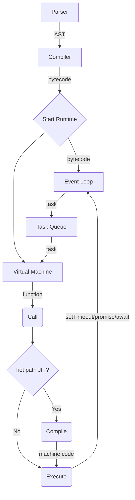

## GO_JS: A javaScript runtime and a JIT-compiler
A javascript runtime built from scratch using GO

**Features**

- Event loop (setTimeout, async/await, micro/macro task queues)
- [mark-and-sweep](https://en.wikipedia.org/wiki/Tracing_garbage_collection) Garbage collection
- Bytecode VM (A custom stack based virtual machine)
- [JIT](https://en.wikipedia.org/wiki/Just-in-time_compilation) compilation
- Closures / Classes 
- Core language support: Prototypal inheritance, for..of, for..in, while, for, try/catch, Promises, let/const, object destructuring, generators
- String, Date, Array, Object, Map, Promise and Set prototypes 

## Flow of execution / Design

1. [Parse](runtime/parser/parser.go) javascript file into an [AST](https://en.wikipedia.org/wiki/Abstract_syntax_tree), (uses a port of [acorn](https://github.com/acornjs/acorn) to golang.)
2. [Pre-pass](runtime/compiler/prepass.go) the syntax tree to define all variables to symboltables and figure out if anything is captured by a closure etc.
3. [Compile](runtime/compiler/compiler.go) the syntax tree into a custom [bytecode](https://en.wikipedia.org/wiki/Bytecode)
4. Start 2 goroutines, one for the [virtual machine](runtime/vm/vm.go) and one for the [event loop](runtime/eventloop/eventloop.go)
    - The vm listens to our eventloop
5. Dispatch our generated function (the bytecode) to the event loop
6. VM picks up our function and begins executing
   - during execution, if a function gets called more than the threshold for "hot path", and the [JIT compiler](runtime/jit/compiler.go) has translation steps for the bytecode used in the function, the VM requests a JIT compiled version of the function and executes it
   - all possible encounters with setTimeouts/await instructions are dispatched to our eventloop accordingly
   - when out of work VM will first drain the microtask queue, after that it will consumethe task queue
7. If our VM is not executing and eventloop doesn't have any work, we have finished our program

## Implementation Scope & A real world example

The runtime is not a _full_ ECMAScript implementation, for example `var` is completely omitted, it can handle an [Advent Of Code](test/aoc/solution.js) puzzle which encompasses a lot of useful language features, also scripts in the [test-scripts](test/test-scripts/) folder give a good representation of the language features implemented.

## How to run
Requires go version `1.22.5`
1. `git clone` the repo
2. `cd /runtime`
3. `go run main.go <your_javascript_file.js>` use `--debug` flag to see all the fun stuff

Test suite can be run with docker by running `./test.sh` in the root of the repo.

## Test runner 
The test runner is neatly packaged in to a docker container.

**[`test.sh`](/test.sh)**

1. Run [test-scripts](test/test-scripts/) against NodeJS
2. Run [test-scripts](test/test-scripts/) against GO_JS
3. Assert that the outputs are identical

After the test run few benchmark scripts are also ran against nodeJS to compare the performance (essentially comparing against V8). Below is one example run summarized (The test suite was ran on my local machine)

| Benchmark | NodeJs | GO_JS |
| --- | --- | --- |
| 'naive-recursive-fib.js' | 545ms | 590ms |
| 'try-catch-shenanigans.js' | 1037ms | 509ms |
| 'string-operations.js' | 14ms | 49ms |
| 'array-iteration.js' | 34ms | 108ms |
| 'object-access.js' | 55ms | 481ms |
